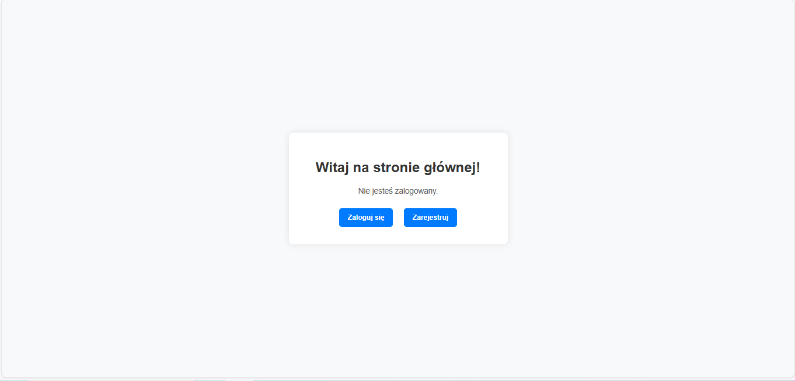
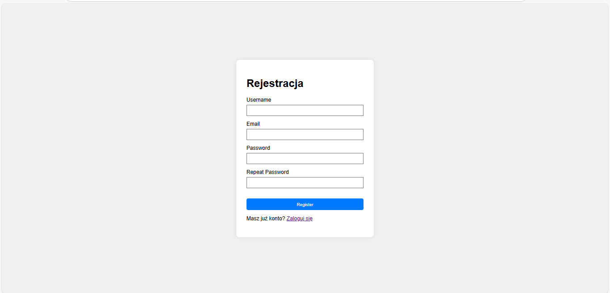
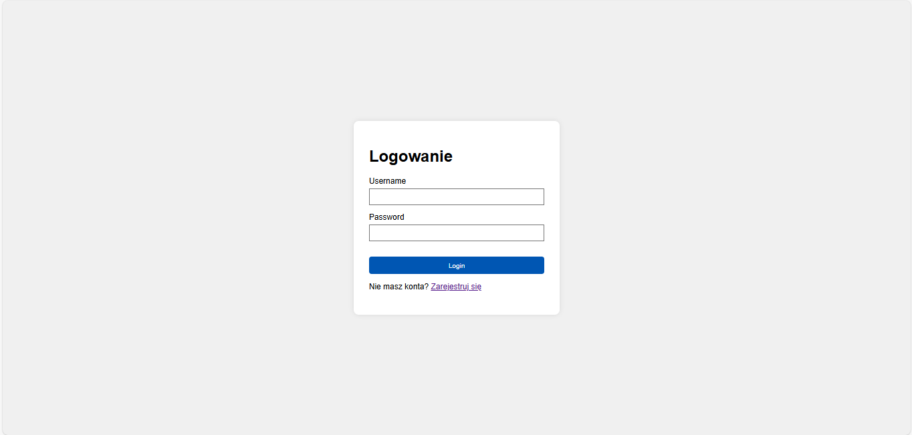
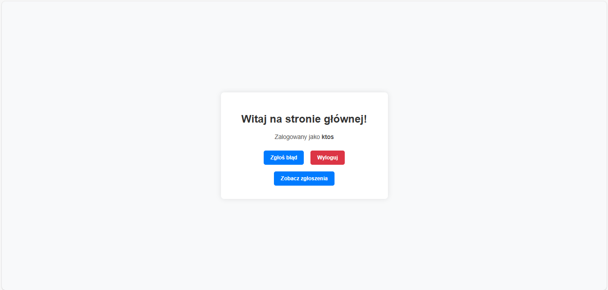
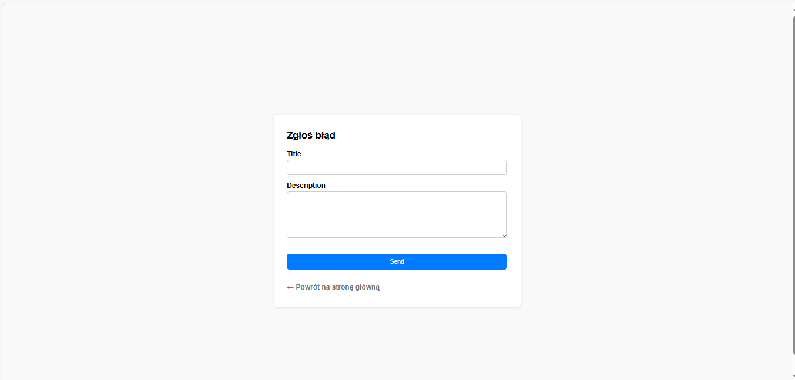
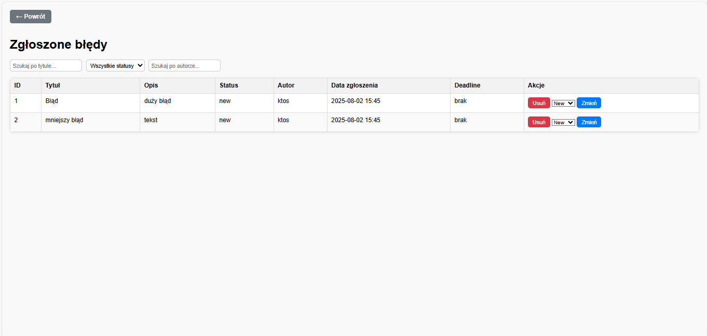

# 🐞bug-tracker-flask
- A web application for managing bug reports and editing their detailed data. Created in Python using the Flask framework. It allows easy tracking and updating of bug statuses within a project.
## Project Structure
- bug-tracker-flask/
- │
- ├── app/
- │ ├── init.py # Flask app initialization
- │ ├── extensions.py # Extensions initialization (SQLAlchemy)
- │ ├── forms.py # WTForms forms
- │ ├── models.py # SQLAlchemy models
- │ ├── routes.py # Flask routes
- │ ├── static/ # Static files (CSS)
- │ └── templates/ # HTML templates
- │
- ├── run.py # Application entry point
- └── requirements.txt # Python dependencies list
## ⚙️ Installation and running
 ```bash   
# 1️⃣ Clone the repository
git clone https://github.com/twoj-login/bug-tracker-flask.git

# 2️⃣ Enter the project directory
cd bug-tracker-flask

# 3️⃣ Create and activate virtual environment
python -m venv venv
source venv/bin/activate  # Linux/Mac
venv\Scripts\activate     # Windows

# 4️⃣ Install required packages
pip install -r requirements.txt

# 5️⃣ Run the application
python run.py
```
## 🛠 Technologies
The project uses the following technologies and libraries:

- **Python** — main programming language
- **Flask** — lightweight web framework
- **Flask-Login** — user session and login management
- **Flask-Migrate** — database migrations (based on Alembic) 
- **Flask-SQLAlchemy** — ORM for database interactions
- **Flask-WTF** — form handling and validation (WTForms)
- **Alembic** — database migration tool
- **SQLAlchemy** — Python ORM library
- **WTForms** — library for creating and validating forms
- **Jinja2** — HTML template engine
- **Werkzeug** — WSGI library used by Flask
- **Mako** — alternative template engine (optional)
- **email_validator** — email address validation
- **dnspython**, **idna** — DNS and IDN support, used by other packages
- **click** — CLI tool used by Flask
- **blinker** — signaling/event system
- **itsdangerous** — secure data signing (e.g., for sessions)
- **greenlet** — used by SQLAlchemy for concurrency
- **typing_extensions** — Python typing extensions
## 📸 Screenshots

### Main page - not log in


### Registration


### Login


### Main page - logged in


### Report submission form


### Reports page

